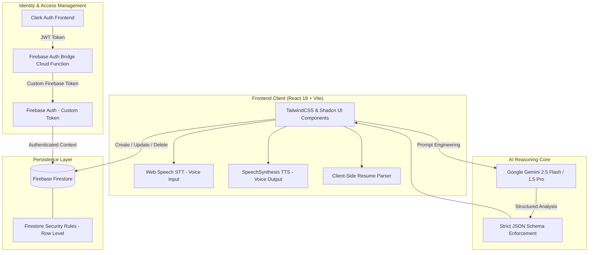

# 🎙️ AI Mock Interview Platform

<div align="center">


<p align="center">
  <strong>An enterprise-grade, full-stack AI interview preparation and evaluation platform.</strong><br>
  Conducts interactive real-time conversational interviews, analyzes candidate resumes against job specifications, generates adaptive 2026-standard software engineering challenges, and delivers rigorous, calibrated hiring feedback reports.
</p>

[Explore Features](#-key-capabilities) • [System Architecture](#-system-architecture) • [Getting Started](#-getting-started) • [Environment Setup](#-environment-variables) • [Evaluation System](#-calibrated-hiring-evaluation-system)

</div>

---

## 📌 Executive Overview

Most mock interview tools rely on static question sets, superficial evaluations, or generous default scores that fail to prepare engineers for the realities of modern technical hiring.

This platform bridges that gap by behaving like a seasoned **Staff / Principal Technical Interviewer**. It leverages **Google Gemini AI**, real-time **Web Speech STT/TTS**, and a **custom resume analysis engine** to conduct dynamic, bidirectional interviews tailored to the candidate's actual projects, years of experience, and chosen tech stack.

---

## ✨ Key Capabilities

### 1. 🎙️ Real-Time Live AI Conversational Interview Mode
- **Adaptive Dialogue Loop**: The AI interviewer greets the candidate, asks open-ended technical questions, listens to responses via speech recognition, and asks contextual follow-ups based on what was said.
- **Bi-Directional Voice Engine**: Seamless combination of browser **SpeechSynthesis (TTS)** and **Web Speech API (STT)** with automatic conversational pause recovery and audio loop feedback prevention.
- **Natural Interaction Controls**: Candidate can pause/resume microphone, interrupt AI speech instantly with **"Speak Now"**, replay question audio, or type in the real-time editable transcript.
- **Drift-Proof Session Timer**: Hardware-synchronized countdown timer with automatic graceful wrapping when time expires.
- **Live Conversation Transcript Log**: Chronological audit trail showing every turn between candidate and AI.

### 2. 📄 Resume-Based Technical Assessment
- **Multi-Format Ingestion**: Supports `.pdf`, `.docx`, and `.txt` file uploads with client-side text parsing.
- **Claim Extraction & Deep Verification**: Extracts key projects, architectural patterns, database choices, and quantitative achievements.
- **Tailored Question Generation**: Interrogates the candidate on specific claims made in their resume (e.g., microservices migration, caching strategies, scaling trade-offs).
- **Resume Verification Matrix**: Final evaluation includes a dedicated **Claim vs Demonstrated Evidence** matrix identifying verified strengths and areas needing stronger proof.

### 3. 🧠 2026 Modern Software Engineering Question Engine
- **Scenario & Trade-Off Focused**: Moves away from textbook trivia toward modern architecture: distributed state, concurrency, latency trade-offs, incident debugging, and production failure recovery.
- **Seniority-Calibrated**: Formulates distinct problem domains for Junior, Mid-Level, Senior, Staff, and Lead engineers.
- **Focus Area Customization**: Target specialized domains such as System Design, Frontend Performance, Distributed Systems, Cloud Architecture, or API Engineering.

### 4. ⚖️ Calibrated, Rubric-Based Hiring Evaluation
- **Zero Fake High Scores**: Eradicates generic 7-8/10 defaults. Performance is strictly graded against industrial hiring rubrics.
- **Early Termination & Abandonment Detection**: If a candidate quits early ($\le 2$ turns) or skips questions, the session is realistically penalized with **1.0 - 2.5 / 10 ("Strong No Hire — Abandoned Early")**.
- **Superficial Answer Penalties**: One-word, evasive ("idk", "skip"), or shallow answers receive appropriate low scores ($1-2/10$) with candid interviewer notes.
- **4-Pillar Competency Breakdown**:
  - 💻 *Technical Knowledge*
  - 💬 *Communication & Clarity*
  - 🧠 *Problem Solving & Trade-off Analysis*
  - 🎯 *Relevance & Depth*
- **Actionable Growth Plan**: Delivers targeted recommendations, recommended response frameworks (e.g., STAR/PREP), and model answers for both attempted and skipped questions.

### 5. 📝 Self-Paced Practice Mode
- Modular question-by-question interview flow with individual voice recording and grading.
- **Completion-Adjusted Scoring**: Unattempted questions receive 0/10, providing an accurate, honest test score across all planned questions.
- Comprehensive accordion review with expected model answers for continuous learning.

### 6. 🔐 Dual-Layer Security & Auth Bridge
- **Clerk Authentication** on the frontend for smooth sign-in, session handling, and user profile management.
- **Firebase Auth Bridge**: Uses Firebase Cloud Functions to mint authenticated Firebase custom tokens linked to the Clerk User ID.
- **Strict Firestore Security Rules**: Granular, row-level ownership validation ensuring users can only read, write, and delete their own interview sessions.

---

## 🏛️ System Architecture



---

## 🛠️ Technology Stack

| Domain | Technology | Description |
|---|---|---|
| **Core Framework** | [React 18](https://react.dev/) | Component-driven UI architecture with hooks and memoization |
| **Build Tooling** | [Vite 5](https://vitejs.dev/) | Next-generation fast frontend tooling and HMR |
| **Styling & Design** | [Tailwind CSS](https://tailwindcss.com/) + [Shadcn UI](https://ui.shadcn.com/) | Modern design tokens, accessible dialogs, accordions, and badges |
| **Authentication** | [Clerk](https://clerk.com/) | Identity management, social auth, and session controls |
| **Backend & Database** | [Firebase Firestore](https://firebase.google.com/docs/firestore) | Real-time cloud NoSQL database for session and answer persistence |
| **Cloud Functions** | [Firebase Functions](https://firebase.google.com/docs/functions) | Serverless bridge for Clerk-to-Firebase Auth custom token creation |
| **AI Intelligence** | [Google Gemini API](https://ai.google.dev/) | Generates technical interview questions, adaptive turns, and rubrics |
| **Voice & Media** | [Web Speech API](https://developer.mozilla.org/en-US/docs/Web/API/Web_Speech_API) | Browser-native Speech Recognition & Speech Synthesis |
| **Document Parsing** | [pdfjs-dist](https://github.com/mozilla/pdf.js) + [mammoth](https://github.com/mwilliamson/mammoth.js) | Client-side PDF and DOCX text extraction |
| **Icons & Alerts** | [Lucide React](https://lucide.dev/) + [Sonner](https://sonner.emilkowal.ski/) | Modern iconography and responsive toast notifications |

---

## 📁 Repository Structure

```
AI-Mock-Interview-Platform/
├── README.md                      # Primary project documentation
├── .env.example                   # Root environment configuration template
└── ai-interview/                  # Core application package
    ├── index.html                 # HTML entry point
    ├── vite.config.js             # Vite configuration with path aliases (@/)
    ├── tailwind.config.js         # Tailwind theme & design tokens
    ├── firestore.rules            # Secure row-level database security rules
    ├── firebase.json              # Firebase Hosting & Emulator configuration
    ├── package.json               # Dependencies and build scripts
    ├── functions/                 # Firebase Cloud Functions (Auth Bridge)
    │   ├── index.js               # Clerk webhook & Custom Token minting
    │   └── package.json
    └── src/
        ├── App.jsx                # Application root with router
        ├── main.jsx               # React DOM bootstrapping with Clerk Provider
        ├── Routes/                # Primary route views
        │   ├── Home.jsx           # Landing page with hero & feature highlights
        │   ├── Dashboard.jsx      # Interview catalog with real-time sync
        │   ├── CreateEditPage.jsx # New interview wizard (Practice / Live / Resume)
        │   ├── LiveInterviewPage.jsx # Real-time voice AI interview room
        │   ├── MockInterviewPage.jsx # Self-paced practice interview mode
        │   ├── FeedBack.jsx       # Calibrated performance analytics report
        │   └── Contact.jsx        # User feedback & support
        ├── components/            # UI Components
        │   ├── FormMockInterview.jsx # Multi-step creation form with file upload
        │   ├── QuestionSection.jsx   # Question tabs with voice narration
        │   ├── RecordAnswer.jsx      # Speech recording and evaluation trigger
        │   ├── InterviewPin.jsx      # Interview card with delete confirmation
        │   └── ui/                   # Shadcn UI primitives (Dialog, Badge, etc.)
        └── services/              # Infrastructure & external service integrations
            ├── gemini.js          # Google Gemini prompt engineering & schemas
            ├── firebase.js        # Firebase app & Firestore initialization
            ├── firebaseAuthBridge.js # Bridge hook linking Clerk to Firebase Auth
            ├── interviewService.js   # CRUD operations for interviews & answers
            └── resumeService.js      # Client-side PDF/DOCX text extractors
```

---

## 🚀 Getting Started

### Prerequisites

- **Node.js**: v18.0.0 or higher
- **npm**: v9.0.0 or higher
- A **Google AI Studio** Gemini API Key ([Get one here](https://aistudio.google.com/))
- A **Clerk** account ([Create one here](https://clerk.com/))
- A **Firebase** project with Firestore enabled ([Firebase Console](https://console.firebase.google.com/))

### Installation

1. **Clone the repository:**
   ```bash
   git clone https://github.com/Ajaykumaryadav-Aj/ai-interview-platform.git
   cd ai-interview-platform/ai-interview
   ```

2. **Install dependencies:**
   ```bash
   npm install
   ```

3. **Install Cloud Functions dependencies:**
   ```bash
   cd functions
   npm install
   cd ..
   ```

---

## 🔐 Environment Variables

Create a `.env.local` file inside the `ai-interview/` directory:

```env
# ── Clerk Authentication ──────────────────────────────────────
VITE_CLERK_PUBLISHABLE_KEY=pk_test_your_clerk_publishable_key

# ── Google Gemini AI ──────────────────────────────────────────
VITE_GEMINI_API_KEY=AIzaSyYourGeminiApiKeyHere

# ── Firebase Client Configuration ─────────────────────────────
VITE_FIREBASE_API_KEY=AIzaSyYourFirebaseApiKey
VITE_FIREBASE_AUTH_DOMAIN=your-app.firebaseapp.com
VITE_FIREBASE_PROJECT_ID=your-project-id
VITE_FIREBASE_STORAGE_BUCKET=your-app.appspot.com
VITE_FIREBASE_MESSAGING_SENDER_ID=123456789012
VITE_FIREBASE_APP_ID=1:123456789012:web:abcdef123456

# ── Optional: Firebase Emulators ──────────────────────────────
# VITE_USE_FIREBASE_EMULATOR=true
```

For Cloud Functions, configure `ai-interview/functions/.env.local`:
```env
CLERK_SECRET_KEY=sk_test_your_clerk_secret_key
```

---

## 💻 Running the Application

### Development Mode

Run the local Vite development server:
```bash
npm run dev
```
Open [http://localhost:5173](http://localhost:5173) in your browser.

### Local Firebase Emulators (Optional)

To test Firestore security rules and functions locally:
```bash
npm run emulators
```

### Production Build & Linting

```bash
# Verify ESLint rules
npm run lint

# Build production bundle
npm run build
```

---

## ⚖️ Calibrated Hiring Evaluation System

Unlike standard LLM mock tools that praise every response, this platform enforces strict calibration rules:

| Candidate Action | AI Evaluation Result | Hiring Recommendation |
|---|---|---|
| **Abandons session early ($\le 2$ turns)** | **1.0 – 2.0 / 10** | `Strong No Hire — Abandoned Early` |
| **Gives evasive / one-word answers ("idk", "skip")** | **1.0 – 2.5 / 10** | `Strong No Hire — Superficial Responses` |
| **Partial interview ($3-4$ short turns)** | **2.5 – 3.8 / 10** | `No Hire — Incomplete Interview` |
| **Answers with basic definitions, lacks depth** | **4.5 – 5.8 / 10** | `Borderline / Needs Work` |
| **Comprehensive, discusses trade-offs & edge cases** | **7.5 – 9.2 / 10** | `Strong Hire` |

### Evaluation Output Breakdown
Every completed or premature session generates a comprehensive diagnostic report:
- **Calibrated Overall Score**: Weighted across technical accuracy, reasoning depth, and interview completion ratio.
- **Hiring Recommendation Badge**: Color-coded badges indicating `Strong No Hire`, `No Hire`, `Borderline`, `Hire`, or `Strong Hire`.
- **Competency Deep-Dive**: Direct quotes from candidate transcript paired with observed strengths and targeted improvements.
- **Claim vs Evidence Matrix (Resume Mode)**: Highlights whether claimed technologies and achievements were substantiated during questioning.
- **Action Plan**: Specific areas to study before the next interview (Technical Revision, Communication Technique, Problem-Solving Habit, Interview Framework).

---

## 🔒 Security & Firestore Rules

User data is protected by row-level Firestore rules in [`firestore.rules`](file:///c:/Users/Ajay%20Kumar/Desktop/AI-Mock-Interview-Platform/ai-interview/firestore.rules):
- **Authentication Required**: Only authenticated users with matching `userId` can read, create, update, or delete interviews.
- **Tamper Protection**: Users cannot modify interview ownership or tamper with other candidates' transcripts.
- **Cascading Safety**: Deleting an interview cleanly removes its document and associated question records.

---

## 🤝 Contributing

Contributions, issues, and feature requests are welcome!

1. Fork the Project
2. Create your Feature Branch (`git checkout -b feature/NewCapability`)
3. Commit your Changes (`git commit -m 'feat: Add NewCapability'`)
4. Push to the Branch (`git push origin feature/NewCapability`)
5. Open a Pull Request

---

## 📄 License

Distributed under the **MIT License**. See `LICENSE` for more information.

---

<div align="center">
  <p>Built with ❤️ by <a href="https://github.com/Ajaykumaryadav-Aj"><strong>Ajay Kumar</strong></a></p>
  <p>⭐ Star this repository if you found it useful for your technical interview preparation!</p>
</div># ai-mock-interview-platform

