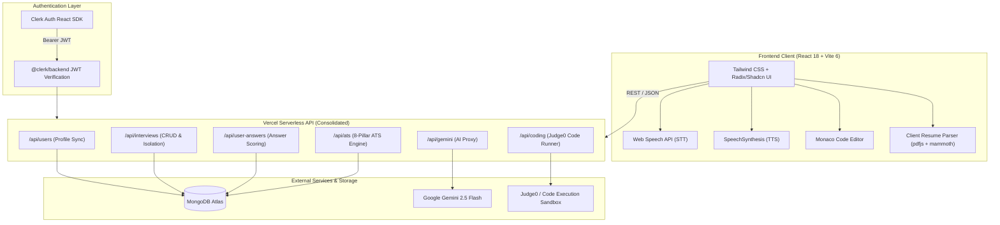

# 🎙️ MocInterview — AI Mock Interview & ATS Career Platform

<div align="center">

[](https://mocinterview.vercel.app/)
[](https://react.dev/)
[](https://vitejs.dev/)
[](https://ai.google.dev/)
[](https://www.mongodb.com/)
[](https://clerk.com/)
[](https://tailwindcss.com/)
[](LICENSE)

<p align="center">
  <strong>An enterprise-grade, full-stack AI interview preparation, live coding, and ATS resume evaluation platform.</strong><br>
  Built for developers, freshers, and college students to master high-stakes technical interviews with real-time speech dialogue, instant rubric scoring, Monaco-based coding rounds, and comprehensive ATS resume audits.
</p>

[Explore Features](#-key-capabilities) • [System Architecture](#-system-architecture) • [Tech Stack](#-technology-stack) • [Getting Started](#-getting-started) • [Environment Setup](#-environment-variables) • [API Reference](#-api-architecture--serverless-endpoints) • [Evaluation System](#-calibrated-hiring-evaluation-system)

</div>

---

## 📌 Executive Overview

Most interview preparation tools rely on static question sets, superficial evaluations, or generous default scores (7–8/10) that give candidates false confidence.

**MocInterview** simulates a seasoned **Staff / Principal Technical Interviewer**. It leverages **Google Gemini AI**, real-time **Web Speech STT/TTS**, a dedicated **Monaco Code Execution Engine**, and an **8-Pillar ATS Resume Parser** to conduct dynamic, bidirectional interviews tailored to the candidate's actual projects, years of experience, and chosen tech stack.

---

## ✨ Key Capabilities

### 1. 🎙️ Real-Time Live AI Conversational Interview
- **Adaptive Dialogue Loop**: The AI interviewer greets the candidate, asks open-ended technical questions, listens to spoken responses, and probes deeper with contextual follow-up questions.
- **Bi-Directional Voice Engine**: Seamless combination of browser **SpeechSynthesis (TTS)** and **Web Speech API (STT)** with automatic conversational pause recovery and audio loop feedback prevention.
- **Natural Interaction Controls**: Candidate can pause/resume microphone, interrupt AI speech instantly with **"Speak Now"**, replay question audio, or edit transcripts in real time.
- **Drift-Proof Session Timer**: Hardware-synchronized countdown timer with graceful automatic wrap-up when time expires.
- **Live Conversation Transcript Log**: Chronological audit trail showing every turn between candidate and AI.

### 2. 💻 Interactive Coding Round & Online IDE
- **Embedded Monaco Editor**: Full-featured code editor with syntax highlighting, line numbering, auto-formatting, and keyboard shortcuts.
- **Multi-Language Support**: Practice in JavaScript, TypeScript, Python, Java, C++, and more.
- **Automated Test Execution**: Integrated with Judge0 / sandbox runner to execute code against pre-configured public and hidden test cases.
- **Real-Time Scorecard**: Instant evaluation on execution time, memory usage, algorithm correctness, and edge-case handling.

### 3. 📄 Deep ATS Resume Checker & Compatibility Audit
- **8 Core ATS Pillars**: Scans resumes across parseability, section headings, format safety, role-specific technical keywords, quantifiable impact metrics, and project depth.
- **Role Detection & Calibration**: Automatically identifies candidate specialization (Frontend, Full Stack, Flutter, Python/ML, Mobile) and scores relevance accordingly.
- **Missing Keyword & Skill Identification**: Highlights missing high-impact technical keywords and industry-standard tools for target roles.
- **Actionable Bullet Point Enhancer**: Rewrites weak responsibilities into measurable, metric-driven achievements using industry frameworks.
- **Instant 1-Click Samples**: Pre-loaded candidate resumes for instant testing and demonstration without uploading personal files.
- **Multi-Format Ingestion**: Supports `.pdf`, `.docx`, and raw `.txt` files with client-side text extraction (`pdfjs-dist` + `mammoth`).
- **Audit-to-Interview Pipeline**: Generate a personalized mock interview directly from identified ATS resume gaps with a single click.

### 4. 🧠 Calibrated, Rubric-Based Hiring Evaluation
- **Zero Fake High Scores**: Eradicates generic defaults. Performance is strictly graded against industrial hiring rubrics.
- **Early Termination & Abandonment Detection**: Sessions quit early ($\le 2$ turns) or skipped questions receive honest scores ($1.0 - 2.5 / 10$) with `Strong No Hire — Abandoned Early`.
- **Superficial Answer Penalties**: One-word or evasive ("idk", "skip") answers are penalized with candid diagnostic feedback.
- **4-Pillar Competency Breakdown**:
  - 💻 *Technical Knowledge & Accuracy*
  - 💬 *Communication & Clarity*
  - 🧠 *Problem Solving & Trade-off Analysis*
  - 🎯 *Relevance & Depth*
- **Actionable Growth Plan**: Provides STAR/PREP frameworks and model benchmark answers for continuous improvement.

### 5. 🎯 Tailored Interview Tracks & High-Intent SEO Hubs
- Tailored landing tracks and question banks for:
  - **JavaScript Mock Interview** (Closures, Event Loop, Promises, Async/Await, Prototypes, ES6+)
  - **React & Frontend Engineering** (Virtual DOM, Reconciliation, Hooks, State Architecture)
  - **Technical Interview & System Design** (Data structures, algorithms, scalability, distributed state)
  - **HR & Behavioral Drills** (STAR framework, situational challenges, leadership narratives)
  - **Mock Interview for Freshers** (Campus placements, foundational CS, project walkthroughs)
- Complete SEO optimization: Dynamic JSON-LD structured data (`WebSite`, `Organization`, `SoftwareApplication`, `FAQPage`), OpenGraph meta tags, and semantic search crawlability.

### 6. ⚡ Zero-FOUC & 100% Fluid Responsive UI
- **Zero Flash of Unstyled Content (FOUC)**: Critical inline-styled initial loader (`#app-initial-loader`) paints at Frame 0; primary stylesheet linked in `<head>` ensures no unstyled text is ever shown to users.
- **Seamless Route Suspense**: Header and footer remain persistently mounted during page transitions, while only the main content area smoothly displays route loaders.
- **Universal Responsiveness**: Pixel-perfect layout adaptation across all devices:
  - Mobile Phones (320px–480px, iPhone SE, Samsung Galaxy)
  - Tablets & Foldables (768px–1024px)
  - Laptops with Windows Display Scaling (125% / 150%) & Brave Browser vertical sidebars
  - UltraWide 4K Desktops (1440px+)

### 7. 🔐 Multi-Tenant Security & Clerk Authentication
- **Clerk Authentication**: Social login (Google, GitHub), email/password, and session management.
- **Serverless Security Enforcer**: Backend JWT verification on all `/api/*` endpoints.
- **Tenant Data Isolation**: Automated tests verify that User A cannot read, update, or delete User B's interview sessions or answers (0% data leakage).

---

## 🏛️ System Architecture



---

## 🛠️ Technology Stack

| Layer | Technology | Details / Purpose |
|---|---|---|
| **Frontend Framework** | [React 18.3](https://react.dev/) | Functional components, hooks, custom state handlers, React.lazy code splitting |
| **Build & Bundler** | [Vite 6](https://vitejs.dev/) | Ultra-fast HMR, Rollup production chunking, and local Serverless API simulation plugin |
| **Routing** | [React Router 7](https://reactrouter.com/) | Nested layouts, public SEO landing routes, dynamic route-level Suspense boundaries |
| **Styling & Design System** | [Tailwind CSS 3.4](https://tailwindcss.com/) + [Radix UI](https://www.radix-ui.com/) | Design tokens, accessible dialogs, sheets, tooltips, accordions, and custom scrollbars |
| **Authentication** | [Clerk](https://clerk.com/) | Social authentication, session management, and server-side JWT verification |
| **Database** | [MongoDB Atlas](https://www.mongodb.com/) via Native Driver | Production NoSQL storage for users, interviews, answer logs, and ATS audit records |
| **AI Reasoning Core** | [Google Gemini 2.5 Flash](https://ai.google.dev/) | Question generation, adaptive speech turns, STAR model answers, and rubric grading |
| **Code Execution** | [Monaco Editor](https://microsoft.github.io/monaco-editor/) + Judge0 API | In-browser multi-language IDE and automated unit test case evaluation |
| **Voice & Speech** | [Web Speech API](https://developer.mozilla.org/en-US/docs/Web/API/Web_Speech_API) | Native SpeechRecognition (STT) and SpeechSynthesis (TTS) |
| **Document Processing** | [pdfjs-dist](https://github.com/mozilla/pdf.js) + [mammoth](https://github.com/mwilliamson/mammoth.js) | Client-side text parsing for `.pdf` and `.docx` resumes |
| **Deployment Platform** | [Vercel](https://vercel.com/) | Serverless functions consolidated within Hobby plan 12-function limit, edge CDN caching |
| **Testing** | Node.js Test Runner (`node --test`) | Integration tests verifying authentication, tenant isolation, and validation |

---

## 📁 Repository Structure

```
ai-mock-interview-platform/
├── README.md                      # Primary project documentation
├── vercel.json                    # Vercel deployment configuration, rewrites & cache headers
├── .env.example                   # Environment configuration template
└── ai-interview/                  # Core application package
    ├── index.html                 # HTML entry with critical initial loader & SEO noscript
    ├── vite.config.js             # Vite configuration with local Express-emulating API plugin
    ├── tailwind.config.js         # Tailwind theme & design tokens
    ├── package.json               # Dependencies and scripts
    ├── tests/
    │   └── api.test.mjs           # 17 Automated security, auth, and CRUD integration tests
    ├── api/                       # Vercel Serverless Functions
    │   ├── _cors.js               # Centralized CORS & Clerk Auth validation
    │   ├── users.js               # User profile sync & retrieval
    │   ├── interviews.js          # Interview creation, catalog, deletion
    │   ├── user-answers.js        # Candidate answers persistence & scoring
    │   ├── gemini.js              # Serverless Google Gemini prompt proxy
    │   ├── coding.js              # Consolidated coding challenges & Judge0 runner
    │   ├── ats.js                 # Consolidated 8-pillar ATS analyzer & history
    │   └── _lib/                  # Serverless utilities (MongoDB client, Judge0 client, ATS scorer)
    └── src/
        ├── App.jsx                # Application root with router & route definitions
        ├── main.jsx               # React DOM bootstrapping with Clerk Provider & index.css
        ├── index.css              # Global styles, Tailwind base/components/utilities, variables
        ├── Routes/                # Primary route views
        │   ├── Home.jsx           # Landing page with interactive hero & feature sections
        │   ├── Dashboard.jsx      # User interview catalog with real-time stats
        │   ├── CreateEditPage.jsx # New interview wizard (Practice / Live / Resume)
        │   ├── LiveInterviewPage.jsx # Real-time voice AI interview room
        │   ├── MockInterviewPage.jsx # Self-paced practice interview mode
        │   ├── CodingRoundPage.jsx   # Interactive coding challenges with Monaco IDE
        │   ├── AtsResumePage.jsx     # 8-pillar ATS resume checker & audit tool
        │   ├── FeedBack.jsx       # Calibrated performance analytics report
        │   ├── LandingPageRoute.jsx  # Dynamic SEO landing pages for interview tracks
        │   ├── BlogIndexRoute.jsx    # Engineering interview guides & blog index
        │   ├── BlogPostRoute.jsx     # Individual interview guide articles
        │   ├── About.jsx          # About page detailing platform mission & features
        │   ├── Contact.jsx        # User feedback & support form
        │   └── Loaderpage.jsx     # Branded loading spinner component
        ├── components/            # Reusable UI Components
        │   ├── Header.jsx         # Responsive navigation header with adaptive labels
        │   ├── NavigationRoutes.jsx # Desktop & mobile navigation link list
        │   ├── ProfileContainer.jsx # User auth buttons & Clerk UserButton
        │   ├── ToggleContainer.jsx  # Mobile & tablet slide-over navigation drawer
        │   ├── Footer.jsx         # Comprehensive platform footer with SEO links
        │   ├── SEO.jsx            # Dynamic meta tags & JSON-LD structured data injector
        │   ├── FormMockInterview.jsx # Multi-step creation form with file upload
        │   ├── RecordAnswer.jsx      # Speech recording and evaluation trigger
        │   └── ui/                # Accessible Radix primitives (Button, Dialog, Accordion, etc.)
        ├── services/              # Client-side services & API communication
        │   ├── gemini.js          # Google Gemini client & prompt formatting
        │   ├── interviewService.js # API abstraction for interview CRUD
        │   ├── codingService.js   # API abstraction for coding challenges & submissions
        │   └── resumeService.js   # Client-side PDF/DOCX extractors
        └── layouts/               # Nested layout components
            ├── PublicLayouts.jsx  # Persistent Header/Footer with route-level Suspense
            ├── MainLayouts.jsx    # Authenticated user layout with persistent navigation
            └── AuthenticationLayout.jsx # Centered layout for Clerk sign-in/sign-up
```

---

## 🚀 Getting Started

### Prerequisites

- **Node.js**: v18.0.0 or higher
- **npm**: v9.0.0 or higher
- A **MongoDB Atlas** database connection string ([Create free cluster](https://www.mongodb.com/cloud/atlas))
- A **Clerk** account for user authentication ([Create free account](https://clerk.com/))
- A **Google AI Studio** Gemini API Key ([Get free API key](https://aistudio.google.com/))

### Installation

1. **Clone the repository:**
   ```bash
   git clone https://github.com/Ajaykumaryadav-Aj/ai-mock-interview-platform.git
   cd ai-mock-interview-platform
   ```

2. **Install dependencies:**
   ```bash
   cd ai-interview
   npm install
   ```

3. **Configure Environment Variables:**
   Copy the `.env.example` file to `ai-interview/.env.local`:
   ```bash
   cp ../.env.example .env.local
   ```
   Fill in your API keys (see [Environment Setup](#-environment-variables)).

---

## 🔐 Environment Variables

Create `.env.local` inside the `ai-interview/` directory:

```env
# ── Serverless Backend Variables (Never prefix with VITE_) ───
CLERK_SECRET_KEY=sk_test_your_clerk_secret_key
MONGODB_URI=mongodb+srv://<username>:<password>@cluster.mongodb.net/mock_interview?retryWrites=true&w=majority
GEMINI_API_KEY=AIzaSyYourGeminiApiKeyHere

# ── Frontend Public Variables (Exposed to Vite client) ───────
VITE_CLERK_PUBLISHABLE_KEY=pk_test_your_clerk_publishable_key
```

> **Note on Local Development**: `vite.config.js` includes a built-in `localApiPlugin()` that emulates Vercel Serverless Functions locally during `npm run dev`. It automatically reads the server variables from `.env.local` so you do not need a separate Express server running!

---

## 💻 Running the Application

### 1. Development Mode
```bash
npm run dev
```
Open [http://localhost:5173](http://localhost:5173) in your browser. Both frontend and local API endpoints (`/api/*`) are served seamlessly on the same port.

### 2. Run Automated Integration Tests
```bash
npm test
```
Executes the comprehensive suite of 17 integration tests verifying authentication enforcement, user profile creation, multi-tenant isolation, cascade deletions, and input validation.

### 3. Production Build & Linting
```bash
# Verify ESLint code quality
npm run lint

# Build optimized production bundle
npm run build

# Preview production build locally
npm run preview
```

---

## 📡 API Architecture & Serverless Endpoints

To maintain full compliance with **Vercel Hobby Plan's 12-function limit**, the backend uses consolidated, action-based Serverless Functions under `api/`:

| Endpoint | Method | Action / Purpose | Auth Required |
|---|---|---|---|
| `/api/users` | `GET` | Fetch authenticated user profile from MongoDB | Yes |
| `/api/users` | `POST` | Sync / upsert Clerk user profile to MongoDB | Yes |
| `/api/interviews` | `GET` | List interviews belonging exclusively to authenticated user | Yes |
| `/api/interviews` | `POST` | Create a new mock interview session | Yes |
| `/api/interviews?id=:id` | `GET` | Retrieve specific interview details (strict ownership check) | Yes |
| `/api/interviews?id=:id` | `DELETE`| Delete interview session and cascade-delete answers | Yes |
| `/api/user-answers` | `GET` | Fetch saved answers for an interview | Yes |
| `/api/user-answers` | `POST` | Save user answer transcript, feedback, and score | Yes |
| `/api/gemini` | `POST` | Secure server-side proxy for Google Gemini AI generation | Yes |
| `/api/ats` | `POST` | Consolidated ATS engine: `analyze`, `improve`, `create-interview` | Yes |
| `/api/ats` | `GET` | Fetch ATS audit history for authenticated user (`action=history`) | Yes |
| `/api/ats` | `DELETE`| Delete specific ATS audit record (`action=delete&id=...`) | Yes |
| `/api/coding` | `GET` | Retrieve question catalog or submission status | Yes |
| `/api/coding` | `POST` | Execute code submission and validate test cases via Judge0 | Yes |

---

## ⚖️ Calibrated Hiring Evaluation System

Unlike standard LLM mock tools that praise every answer, this platform enforces strict calibration rules:

| Candidate Action | AI Evaluation Result | Hiring Recommendation |
|---|---|---|
| **Abandons session early ($\le 2$ turns)** | **1.0 – 2.0 / 10** | `Strong No Hire — Abandoned Early` |
| **Gives evasive / one-word answers ("idk", "skip")** | **1.0 – 2.5 / 10** | `Strong No Hire — Superficial Responses` |
| **Partial interview ($3-4$ short turns)** | **2.5 – 3.8 / 10** | `No Hire — Incomplete Interview` |
| **Answers with basic definitions, lacks depth** | **4.5 – 5.8 / 10** | `Borderline / Needs Work` |
| **Comprehensive, discusses trade-offs & edge cases** | **7.5 – 9.5 / 10** | `Strong Hire` |

---

## 🔒 Security & Multi-Tenant Data Isolation

1. **Bearer Token Authentication**: Every API request is verified with `@clerk/backend` using the user's session JWT.
2. **Zero Multi-Tenant Data Leakage**: Database queries are strictly scoped to `req.auth.userId`. It is mathematically impossible for User A to inspect or alter User B's interviews, transcripts, or ATS records.
3. **Automated Security Verification**: The test suite actively tests cross-tenant boundary attacks and confirms `403 Forbidden` responses.
4. **Input Sanitization**: All incoming request payloads are validated to prevent NoSQL injection and malicious prompt escapes.

---

## 🤝 Contributing

Contributions, issues, and feature requests are welcome!

1. Fork the Project
2. Create your Feature Branch (`git checkout -b feature/AmazingFeature`)
3. Commit your Changes (`git commit -m 'feat: Add AmazingFeature'`)
4. Push to the Branch (`git push origin feature/AmazingFeature`)
5. Open a Pull Request

---

## 📄 License

Distributed under the **MIT License**. See `LICENSE` for more information.

---

<div align="center">
  <p>Built with ❤️ by <a href="https://github.com/Ajaykumaryadav-Aj"><strong>Ajay Kumar</strong></a></p>
  <p>⭐ Star this repository if you found it useful for your technical interview preparation!</p>
</div>